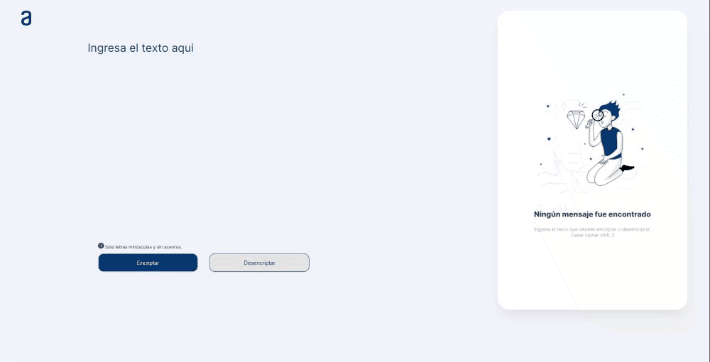

# Alura challenge

User interface `desktop` version


> When the page loads it generates a random number that is used for the shift

```javascript
var alphabet = "abcdefghijklmnopqrstuvwxyz";
var newalpha = "";

function shift(n) {  
  for (let i = 0; i < alphabet.length; i++) {
    let offset = (i + n) % alphabet.length;
    newalpha += alphabet[offset];
  }  
}
```

## Encoder working flow

> javascript function to encode message

```javascript
function encode(message) {
  let result = "";
  message = message.toLowerCase();
  for (let i = 0; i < message.length; i++) {
    let index = alphabet.indexOf(message[i]);
    result += newalpha[index];
  }
  return result;
}
```

## Decoder working flow


> javascript function to decode message

```javascript
function decode(message) {
  let result = "";
  message = message.toLowerCase();
  for (let i = 0; i < message.length; i++) {
    let index = newalpha.indexOf(message[i]);
    result += alphabet[index];
  }
  return result;
}
```

## How Cesars works

The Caesar cipher (or Caesar code) is a monoalphabetic substitution cipher, where each letter is replaced by another letter located a little further in the alphabet (therefore shifted but always the same for given cipher message). The shift distance is chosen by a number called the offset, which can be right (A to B) or left (B to A).


## References

<https://www.dcode.fr/caesar-cipher>

<https://www.thatsoftwaredude.com/content/11425/implementing-a-caesar-cipher-in-javascript>

## Deploy

Github pages
<https://ivanyanez10.github.io/alura_challenge_encryptor/>
